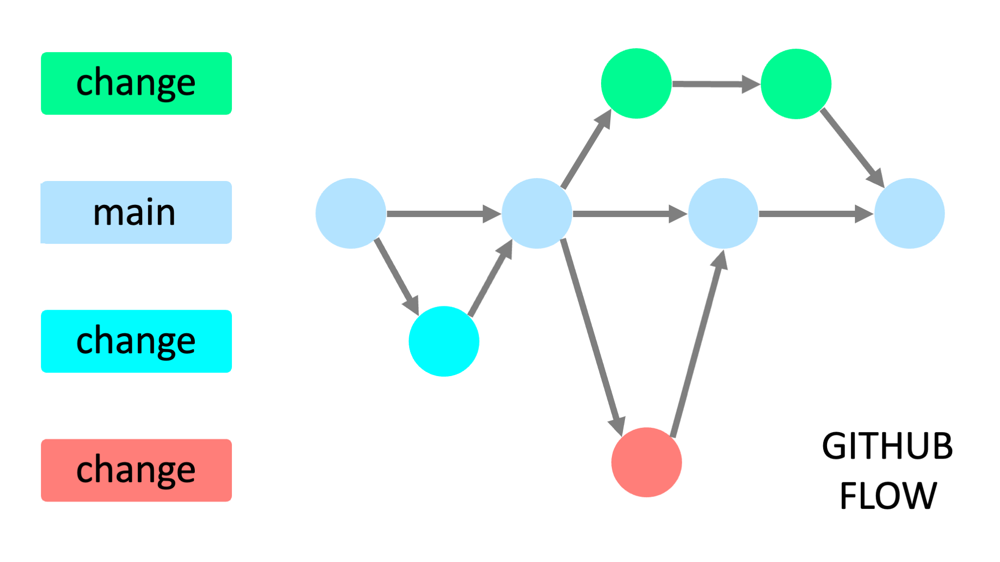

# Git Workflow & Commit Conventions

Version control standards and collaborative development workflow guidelines for the project.

---

## 1. Workflow (GitHub Flow)

This project follows the **GitHub Flow** model: a lightweight, branch-based workflow that supports regular and continuous deployments. The `main` branch is always stable and production-ready.

### Core Principles:
* You develop features in feature branches.
* To create a feature branch, you branch off of the `main` branch.
* Developers iterate, commit, and test the code in the feature branch.
* When a feature is complete, the developer promotes the feature by creating a merge request (or pull request) to `main`.

### Lifecycle:
1. **Branch Off:** Always pull the latest changes from `main` before creating your feature branch.
2. **Iterate & Commit:** Make atomic, descriptive commits following the commit conventions as you work.
3. **Local Testing:** Ensure the code compiles, passes linting checks, and passes all unit/integration tests locally.
4. **Open Pull Request / Merge Request:** Submit a PR/MR against `main` for code review. Describe what changed and link any relevant tickets.
5. **Review & Merge:** Once approved by reviewers and all automated CI checks pass, merge the branch into `main` and delete the feature branch.



---

## 2. Branch Naming Convention

All branches must strictly follow the defined naming format to ensure traceability across issue trackers, commits, and team members.

### Structure:
```text
<branch type>/<story number>_<developer initials>_<descriptor>
```

### Components:
* `<branch type>`: Explained on the next subtitle "Branch Types".
* `<story number>`: Numeric identifier for the user story, issue, or ticket (e.g., Jira issue ID, GitHub Issue number).
* `<developer initials>`: Uppercase initials of the developer assigned to the task (e.g., `MS`).
* `<descriptor>`: A short, descriptive summary of the feature written in `UpperCamelCase` or separated by underscores (`_`).

### Branch Types

| Type | Usage / Description | Example |
| :--- |  :--- | :--- |
| `feature` | You develop features in feature branches. To create a feature branch, you branch off of the main branch. Developers iterate, commit, and test the code in the feature branch. When a feature is complete, the developer promotes the feature by creating a merge request to main. | `feature/671029_AL_Dashboard_Debt_Filter` |
| `bugfix` | The bugfix branch is used to fix issues. These branches are branched off of the main branch. After the bugfix is tested in sandbox or any of the lower environments, it can be promoted to higher environments by merging it to main through a merge request.| `bugfix/123456_MS_Fix_Problem_A` |
| `hotfix` | The hotfix branch is used to resolve high impact critical issues with minimal delay between the development staff and the code deployed in production. These branches are branched off of the main branch. After the hotfix is tested in sandbox or any of the lower environments, it can be promoted to higher environments by merging it to main through a merge request. | `hotfix/123456_MS_Fix_Problem_A` |


---

## 3. Commit Message Conventions (Conventional Commits)

All commits must follow the **Conventional Commits** specification. This provides an explicit history, eases automated changelog generation, and ensures clarity across the team.

### Format:
```text
<type>(<scope>): <action/description>
```

* **Type (`<type>`):** Required prefix that labels the kind of change introduced.
* **Scope (`(<scope>)`):** The specific section, module, or package affected (enclosed in parentheses, lowercase).
* **Action (`<action/description>`):** A concise description written in the imperative mood (e.g., "add", "fix", "update"), without a trailing period.

### Canonical Example:
```text
feat(auth): add Google OAuth authentication
```
* **Change Type:** `feat`
* **Affected Scope:** `(auth)`
* **Action:** `add Google OAuth authentication`

---

### Standard Commit Types (Prefix Nouns / Labels)

| Type | Category | Usage / Description | Example |
| :--- | :--- | :--- | :--- |
| `feat` | Noun | A new user-facing feature (short for "feature"). | `feat(events): generate custom QR code for payment deposits` |
| `fix` | Verb / Noun | A bug fix or patch to resolve an issue. | `fix(payments): resolve calculation error in installment debts` |
| `docs` | Noun | Documentation-only changes (e.g., `.md` files, JSDoc, API specs). | `docs(readme): update setup instructions and environment variables` |
| `chore` | Noun | Routine maintenance tasks that do not modify production code (e.g., updating `.gitignore`, auxiliary scripts). | `chore: update npm dependencies and gitignore rules` |
| `style` | Noun / Verb | Code style, formatting, whitespace, or linting adjustments that do not affect logic. | `style(registration): standardize input field spacing and indentation` |
| `refactor` | Noun / Verb | Code restructuring without altering external behavior or fixing bugs. | `refactor(storage): extract receipt upload logic into dedicated service` |
| `test` | Noun / Verb | Adding missing tests or correcting existing unit/integration tests. | `test(auth): add unit test cases for JWT token validation` |

---

## 4. Best Practices & Guidelines

1. **Atomic Commits:** Each commit should represent a single logical change. Avoid grouping unrelated fixes or features into one commit.
2. **Imperative Mood:** Write commit actions as if you are giving a command (e.g., `add feature` instead of `added feature` or `adds feature`).
3. **No Vague Messages:** Avoid generic messages such as `fix: fix bug`, `update: changes`, or `feat: wip`.
4. **Pre-commit Verification:** Ensure all linters, formatting checks, and local builds pass before pushing commits to remote branches.